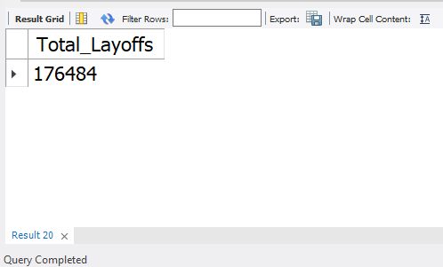
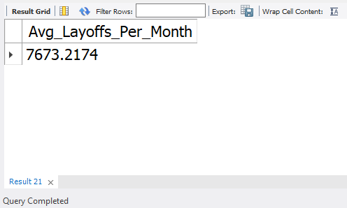
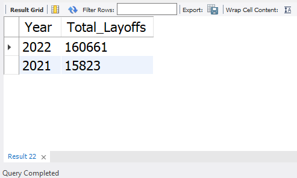
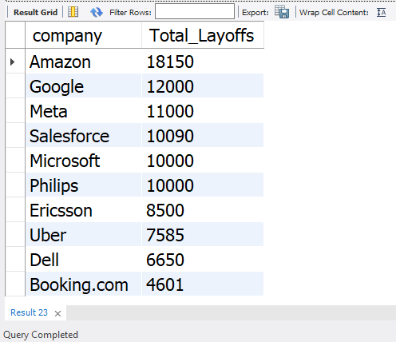
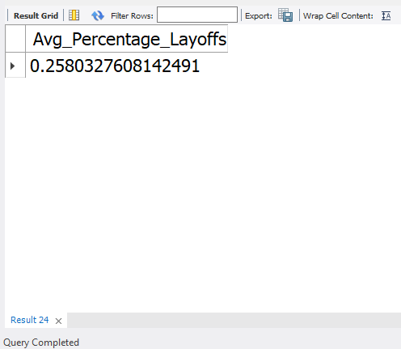

# **Worldwide Layoffs Exploratory Data Analysis**


## **Project Description:**

This is a portfolio project showcasing my skills in using SQL program, specifically MySQL. In this project, I conducted data cleaning and classic exploratory data analysis of [this dataset](https://github.com/Fahruni/Worldwide-Layoffs-Exploratory/blob/main/assets/raw_worldwide_layoffs.csv), controlled by several questions that I have prepared beforehand. The questions were answered by using a wide range of query.

## **Data Cleaning Process:**
1. Creating a new table for cleaning purpose
2. Removing duplicates
3. Standardizing the data
4. Populating blank or null cells
5. Deleting unusable rows and columns

### **Exploratory Data Analysis Process:**
I prepared 12 questions to answer by using the appropriate syntax. Below are some of the questions and answers.

### **1. How many total layoffs occurred from 2021 to 2022?**

Query:
```mysql
SELECT SUM(total_laid_off) AS Total_Layoffs
FROM worldwide_layoffs_staging2
WHERE date BETWEEN '2021-01-01' AND '2022-12-31';
```
Query result:



### **2. What is the average number of layoffs per month?**

Query:
```mysql
SELECT AVG(monthly_layoffs) AS Avg_Layoffs_Per_Month
FROM (
    SELECT DATE_FORMAT(date, '%Y-%m') AS Month, SUM(total_laid_off) AS monthly_layoffs
    FROM worldwide_layoffs_staging2
    WHERE date BETWEEN '2021-01-01' AND '2022-12-31'
    GROUP BY Month
) AS MonthlyLayoffs;
```

Query result:



### **3. How do the total layoffs compare between 2021 and 2022?**

Query:
```mysql
SELECT YEAR(date) AS Year, SUM(total_laid_off) AS Total_Layoffs
FROM worldwide_layoffs_staging2
WHERE date BETWEEN '2021-01-01' AND '2022-12-31'
GROUP BY Year;
```

Query result:



### **4. Which companies had the highest number of layoffs?**

Query:
```mysql
SELECT company, SUM(total_laid_off) AS Total_Layoffs
FROM worldwide_layoffs_staging2
GROUP BY company
ORDER BY Total_Layoffs DESC
LIMIT 10;
```

Query result:



### **5. What is the average percentage of layoffs per company?**

Query:
```mysql
SELECT AVG(percentage_laid_off) AS Avg_Percentage_Layoffs
FROM worldwide_layoffs_staging2;
```

Query result:



## **Notes**

There are still some questions and answers you, as the reader, could find by visiting the [finished project](https://github.com/Fahruni/Worldwide-Layoffs-Exploratory/blob/main/assets/Finished_worldwidelayoffs_analysis.sql). Though, you are required to download then run the queries from the top (to create the table).
